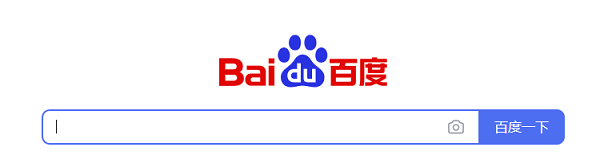

# FREQUENTLY ASKED QUESTIONS

## Feature support

### Does it support BLE devices?

Certainly，`SerialPort` fully supports BLE devices since version `4.0.0`.

### Is there an automatic reconnection mechanism?

Yes, it can be set to reconnect at startup, or it can be automatically reconnected at intervals.See [auto reconnect](./tutorials/configuration_kotlin.html#id3)

## Common problem

### Why is the list of available devices for a custom page empty?

After Android 6.0, you must give the positioning permission to search for available devices.

### Why does the BLE device connect successfully, but cannot send and receive messages, and sometimes an exception occurs?

After the BLE device is successfully connected, it is necessary to set the correct UUID for normal communication.For the specific setting method, see [Set BLE device UUID](./tutorials/discovery_connect_kotlin.html#ble)

## How to solve other problems?

### Enable debug mode

Turn on debug mode to view the printed log information. See [debug mode](./tutorials/configuration_kotlin.html#id2)

### Take advantage of a powerful search engine

### Issues

If the above methods still do not solve the problem, Please open [issues](https://github.com/Shanyaliux/SerialPortSample/issues).

